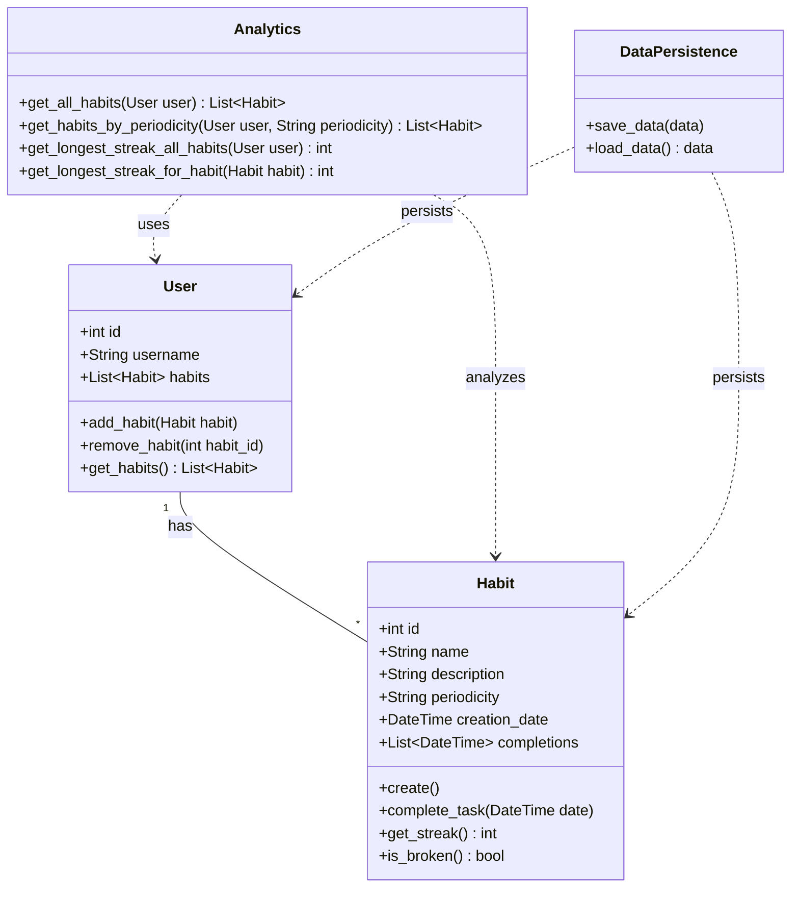

### Habit Tracking Application: Technical Concept

---

#### Overview

We're building a habit tracking application that operates via a command-line interface. The main features are **creating and managing habits**, **tracking completion**, and **analyzing streaks**. Our approach uses functional and object-oriented programming, and we will use SQLite as our Database.

---

#### Core Components

1. **Habit Class**: Will hold all relevant class info. Main class for the program.
2. **Analytics Module**: Allows us to report and analyze habits.
3. **Data Persistence Module**: Handles saving and loading.
4. **CLI Module**: Our interaction module, to be later replaced by our client's GUI. Through this we will order the program around.

---

#### Habit Class

The Habit class is our primary data structure, and is build like this:

**Attributes:**
- `id`: Unique identifier
- `name`: Name of the habit
- `description`: Brief description
- `periodicity`: Either 'daily' or 'weekly'
- `creation_date`: Date the habit was created
- `completions`: List of datetime objects for completion times

**Methods:**
- `create()`: Initializes a new habit
- `complete_task(date)`: Marks a task as complete for a given date
- `get_streak()`: Calculates the current streak (how many times the task's been completed without breaking periodicity)
- `is_broken()`: Checks if the habit was broken

---

#### Data Persistence

We're using SQLite because its both light and easy to integrate using python, and will provide better scalability than storing data in json's or csv's.

1. **Saving Data**: After any operation modifying data:
	- Init transaction
    - Prepare SQL query (INSERT, UPDATE, DELETE)
    - Execute query in transaction
    - Commit transaction if query execution was successful

3. **Loading Data**: On boot, run a SELECT query to get relevant information.

---

#### User Interaction and Flow

Users interact with the application through a CLI. The flow is as follows:

1. **Startup**: User starts the app
2. **Main Menu**: Options include `Create Habit`, `Complete Task`, `View Habits`, `Analyze Habits` , `Exit`
3. **Selection**: User selects an option and follows the given prompts 
4. **Results**: Shows results, then returns to the main menu.
5. **Repeat**: Process repeats until the user exits.

---

#### User Class

We might also implement a User class to support future expansions:

**Attributes:**
- `id`: Unique identifier
- `username`: User's chosen name
- `habits`: List of Habit objects

**Methods:**
- `add_habit(habit)`: Adds a new habit
- `remove_habit(habit_id)`: Removes a habit
- `get_habits()`: Returns all habits

---

#### Analytics Module

Implemented with functional programming principles, the analytics module offers the following functions:

- `get_all_habits(user)`: Returns all habits for a user
- `get_habits_by_periodicity(user, periodicity)`: Gives out daily or weekly habits
- `get_longest_streak_all_habits(user)`: Finds the longest streak across all habits
- `get_longest_streak_for_habit(habit)`: Calculates the longest streak for a specific habit

---

#### Data Flow

1. **User Input**: Enter commands and data via CLI.
2. **Command Processing**: CLI translates input into relevant functions.
3. **Business Logic**: `Habit` and `User` objects are created, modified, or queried.
4. **Data Persistence**: Data updates in the SQLite database after changes.
5. **Output**: Display results via CLI.

---

#### UML Diagram

Here’s a visual representation of the interaction between components:

---