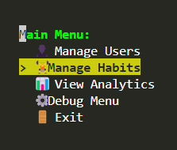

# Command Line Habit Tracker



## Project Overview

This Command Line Habit Tracker is a Python-based app designed for a IU Internationale assignment.

It's a simple interface for creating habits, completing them and tracking those completions over time.

Key features:
- User management
- Habit creation and tracking
- Completion logging
- Analytics and streak tracking
- Interactive TUI

## Table of Contents

- [Installation](#installation)
- [Usage](#usage)
- [File Descriptions](#file-descriptions)
- [Database Structure](#database-structure)
- [Code Structure](#code-structure)
- [How To Use](#how-to-use)

## Installation

1. Clone the repository:
   ```
   git clone https://github.com/alonsoburon/habit-tracker.git
   cd habit-tracker
   ```

2. Create a virtual environment (optional but recommended):
   ```
   python -m venv venv
   source venv/bin/activate
   # On Windows, use `venv\Scripts\activate`
   ```

3. Install the required dependencies:
   ```
   pip install colorama prompt_toolkit
   ```

## Usage

To run the Habit Tracker:

1. Navigate to the folder where you cloned it (should be named `./habit-tracker/`).
2. Run the main script:
   ```
   python main.py
   ```
3. Use the arrow keys to navigate the menus and press Enter to select an option.

## Files

- `main.py`: The entry point of the application. It initializes the main loop and handles the top-level menu.
- `TUI.py`: Contains the Text User Interface, including menu rendering and user input handling. Calls other classes' methods
- `Analytics.py`: Handles data analysis and reporting functions, using Habit and Completions methods.
- `DataPersistence.py`: Manages general database connections and operations, including debug methods.
- `InteractiveMenu.py`: Implements the interactive menu system using prompt_toolkit, handling user interaction.
- `User.py`: Contains the User class for sending & receiving user-related db queries.
- `Habit.py`: Contains the Habit class for managing habit-related db queries.
- `Completions.py`: Contains the Completions class, for sending and handling completions-related db queries.
- `slides.html`: Contains presentation slides for the project (not part of the main application).

## Database Structure

The application uses SQLite3 for data storage. The database consists of three main tables:

1. Users
2. Habits
3. Completions


## Code Structure

The application follows a modular structure with clear separation of concerns:


## How To Use

1. Run `main.py` on your terminal
2. Use the arrow keys to navigate the menus
3. Use the Enter key to select an option
4. When done, Exit the program

### Menu:

1. **Manage Users**: Add, view, or delete users.
2. **Manage Habits**: Add new habits, view existing ones, or mark habits as complete.
3. **View Analytics**: View all habits, habits by periodicity, and longest streaks.
4. **Debug Menu**: Clear the database or fill it with dummy data for testing purposes.
